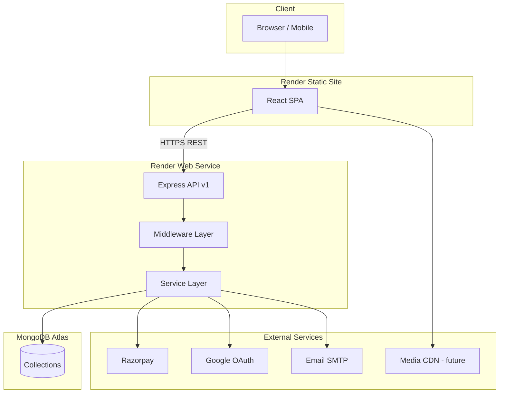

# Reyan Luxe — System Architecture

**Version:** 2.0 (Rebuild)  
**Phase:** 2 — Backend + MongoDB  
**Last Updated:** June 30, 2026

---

## Overview

Reyan Luxe is rebuilt as a **decoupled full-stack e-commerce platform**:

| Layer | Stack | Deployment |
|-------|-------|------------|
| Frontend | React 18, TypeScript, Vite, Tailwind, React Query | Render Static Site |
| Backend | Node.js 20, Express, TypeScript, Mongoose | Render Web Service |
| Database | MongoDB Atlas | Managed cluster |
| Payments | Razorpay | Phase 6 |
| Auth | JWT + Refresh + Google OAuth | Phase 3 |

The legacy Django backend (`backend/`) remains for reference during migration and will be retired after frontend cutover.

---

## Repository Layout

```
reyan/
├── frontend/          # React storefront (preserve UI design language)
├── server/            # NEW — Production Express API (Phase 2+)
├── backend/           # LEGACY — Django + SQLite (deprecated)
├── docs/              # GitHub Pages static build (transitional)
├── PROJECT_AUDIT.md
├── ARCHITECTURE.md
├── DATABASE_SCHEMA.md
├── API_DOCUMENTATION.md
└── PROJECT_STATUS.md
```

---

## High-Level Architecture



---

## Backend Architecture (server/)

### Layered Design

```
src/
├── config/         # Environment validation (Zod)
├── db/             # MongoDB connection
├── models/         # Mongoose schemas + indexes
├── validators/     # Request validation (Zod)
├── services/       # Business logic
├── controllers/    # HTTP handlers
├── routes/         # Route definitions
├── middleware/     # Auth, errors, validation
├── utils/          # Shared helpers
└── scripts/        # Seed, migrations
```

### Request Flow

1. **Helmet** — security headers  
2. **CORS** — allowlisted origins  
3. **Rate limit** — 300 req/15min (production)  
4. **Body parser** — JSON ≤ 1MB  
5. **Router** — `/api/v1/*`  
6. **Validation** — Zod schemas  
7. **Auth/RBAC** — JWT (Phase 3) / temporary admin key  
8. **Controller** — parse request  
9. **Service** — business rules + DB  
10. **Error handler** — consistent JSON errors  

### API Versioning

All new endpoints are prefixed with **`/api/v1`**. This allows future breaking changes under `/api/v2` without disrupting production clients.

---

## Data Architecture

MongoDB collections (see `DATABASE_SCHEMA.md`):

| Collection | Purpose |
|------------|---------|
| `users` | Accounts, roles, addresses |
| `categories` | Dynamic catalog taxonomy + customization field templates |
| `products` | Unified product catalog |
| `carts` | Persistent carts (user + guest session) |
| `orders` | Checkout snapshots + payment refs |
| `reviews` | Product reviews + moderation |
| `coupons` | Discount codes |
| `customizationconfigs` | Configurator definitions + preview layers |
| `inventorylogs` | Stock audit trail |

### Indexing Strategy

- **Text search:** `products` (name, description, tags, sku)  
- **Category browsing:** `products.categoryId + isActive + price`  
- **Inventory:** `products.stock`, `inventorylogs.productId + createdAt`  
- **Orders:** `orders.userId + createdAt`, `orders.orderNumber` unique  
- **Reviews:** `reviews.productId + isApproved + createdAt`  

---

## Category System (Dynamic)

Categories are **fully admin-managed** without code changes:

- Unlimited categories and subcategories (`parentId` tree)
- Each category has a `productType`: `bracelet | earring | bangle | other`
- `customizationFields[]` embedded per category drives the configurator UI
- Menu visibility via `showInMenu` + `sortOrder`

**Seed categories (Phase 2):**
1. Crystal Bead Bracelets  
2. Kundan Stone Earrings  
3. Kundan Stone Bangles  

---

## Authentication (Phase 3 — Planned)

| Concern | Approach |
|---------|----------|
| Access token | JWT, 15 min, Authorization header |
| Refresh token | HTTP-only secure cookie, 7 days |
| Password | bcrypt, cost 12 |
| Google OAuth | Passport / google-auth-library |
| RBAC | `customer` \| `admin` on User model |
| Rate limiting | Stricter on `/auth/*` |

**Phase 2 interim:** Admin catalog mutations use `X-Admin-Key` header (or open in development when unset).

---

## Frontend Integration Plan

The existing frontend will migrate incrementally:

| Legacy endpoint | New endpoint |
|-----------------|--------------|
| `/api/bracelets/` | `/api/v1/products?categoryId=...` |
| `/api/chains/` | `/api/v1/products?categoryId=...` |
| `/api/categories/` | `/api/v1/categories` |
| Token auth header | `Bearer` JWT (Phase 3) |

Update `VITE_API_BASE_URL` to point to Render API URL.

---

## Customization Engine (Phase 5 — Planned)

1. **Category fields** — quick defaults from `Category.customizationFields`  
2. **CustomizationConfig** — rich configs with `previewLayers[]` for 2D compositing  
3. **Phase 5 fallback** — layer-based 2D preview (image swaps per selection)  
4. **Phase 5+ upgrade** — React Three Fiber configurator if 3D assets available  

Price calculation: `base product price + sum(selected option priceModifiers) + engraving fee`.

---

## Security Model

| Control | Status |
|---------|--------|
| Helmet | ✅ Phase 2 |
| CORS allowlist | ✅ Phase 2 |
| Rate limiting | ✅ Phase 2 |
| Input validation (Zod) | ✅ Phase 2 |
| Secrets via env vars | ✅ Phase 2 |
| JWT auth | Phase 3 |
| RBAC | Phase 3 |
| CSRF (cookie auth) | Phase 3 |
| Razorpay signature verify | Phase 6 |

---

## Deployment Topology (Render)

```
Render Static Site  →  VITE_API_BASE_URL=https://reyan-api.onrender.com
Render Web Service  →  MONGODB_URI=mongodb+srv://...
MongoDB Atlas       →  IP allowlist: 0.0.0.0/0 (Render) + peering optional
```

Build commands documented in `DEPLOYMENT_GUIDE.md` (Phase 7).

---

## Phase Roadmap

| Phase | Scope | Status |
|-------|-------|--------|
| 1 | Audit | ✅ Complete |
| 2 | Express + MongoDB + catalog API | ✅ Complete |
| 3 | Auth + Admin dashboard API | Pending |
| 4 | Products admin + inventory API | Pending |
| 5 | Customization engine | Pending |
| 6 | Cart, checkout, Razorpay | Pending |
| 7 | Tests + Render deployment | Pending |

---

## Design Preservation

The frontend **must not** change visual identity during backend migration:

- Primary `#FF0066`, Playfair + Inter fonts  
- Existing page layouts and component library  
- Dark/light theme behavior  

Only functional wiring and missing UX gaps should change.
